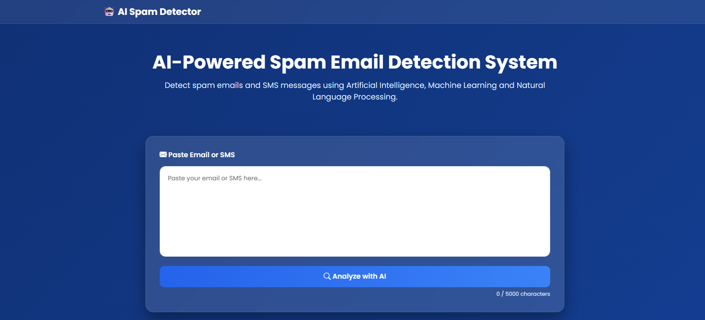
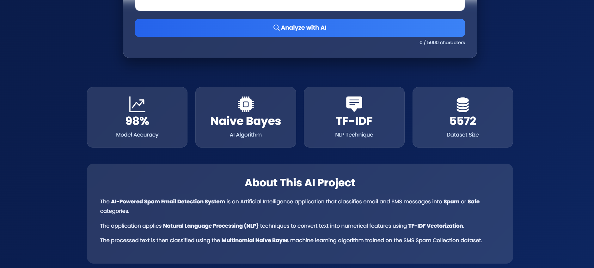
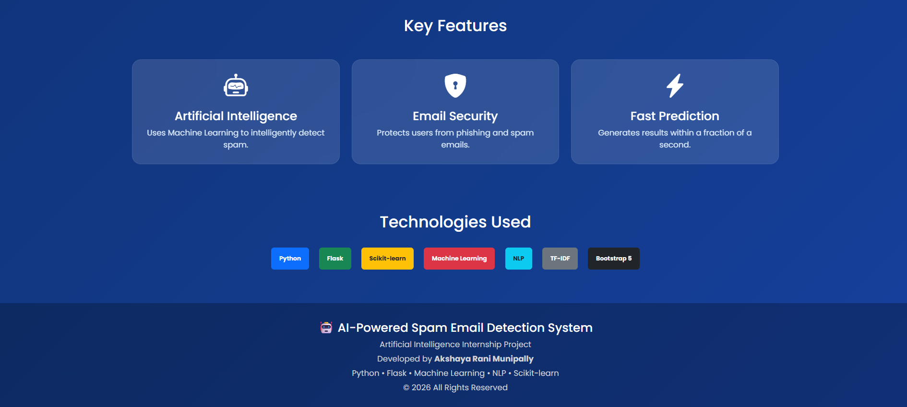
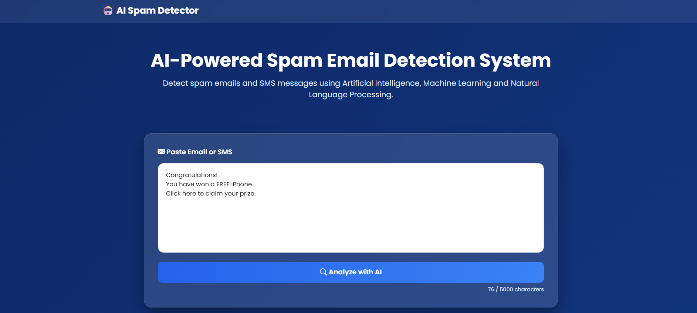
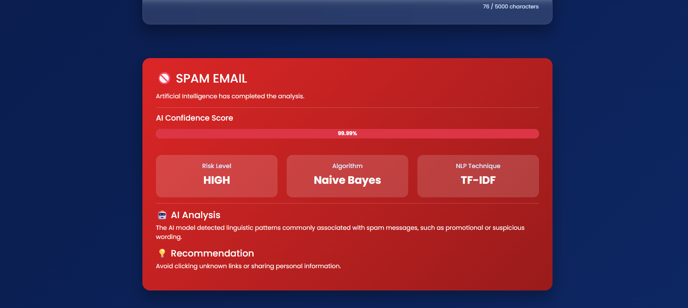
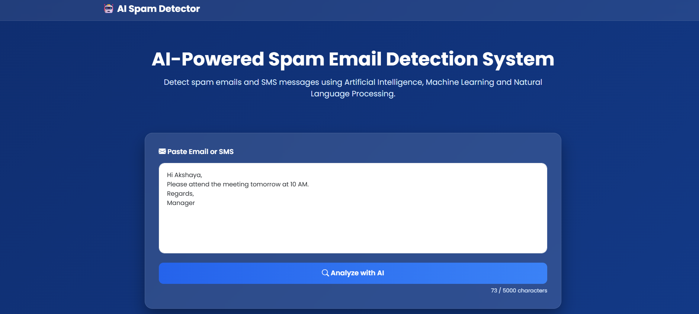
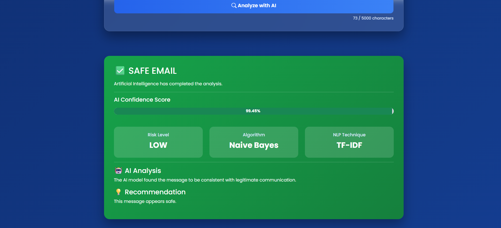

# 🤖 AI-Powered Spam Email Detection System

An Artificial Intelligence web application that detects whether an email or SMS message is **Spam** or **Safe (Ham)** using **Machine Learning** and **Natural Language Processing (NLP)**.

---

## 📌 Project Overview

Spam emails and SMS messages are one of the most common cybersecurity threats. This project uses Machine Learning to automatically classify messages as **Spam** or **Ham** based on their content.

The application provides an easy-to-use web interface built with Flask, allowing users to paste a message and instantly receive the prediction along with a confidence score and recommendation.

---

## 🚀 Features

- ✅ Spam & Safe message detection
- ✅ Machine Learning prediction
- ✅ TF-IDF text vectorization
- ✅ Multinomial Naive Bayes classifier
- ✅ Confidence score
- ✅ AI recommendation
- ✅ Responsive web interface
- ✅ Professional dashboard
- ✅ Bootstrap 5 UI

---

## 🛠️ Technologies Used

- Python
- Flask
- Scikit-learn
- Pandas
- NumPy
- Joblib
- HTML5
- CSS3
- Bootstrap 5
- JavaScript

---

## 🧠 Machine Learning Model

**Algorithm:** Multinomial Naive Bayes

**Text Processing:** TF-IDF Vectorization

**Dataset:** SMS Spam Collection Dataset (5,572 messages)

---

## 📂 Project Structure

```text
AI-Spam-Email-Detection-System/
│
├── app.py
├── predictor.py
├── train_model.py
├── config.py
├── requirements.txt
├── README.md
├── LICENSE
│
├── data/
├── models/
├── reports/
├── screenshots/
├── static/
└── templates/
```

---

## 📷 Screenshots

### 🏠 Home Page







---

### 🚫 Spam Detection





---

### ✅ Safe Detection




---
## ⚙️ Installation

Clone the repository:

```bash
git clone https://github.com/YOUR_USERNAME/AI-Spam-Email-Detection-System.git
```

Go to the project folder:

```bash
cd AI-Spam-Email-Detection-System
```

Install dependencies:

```bash
pip install -r requirements.txt
```

Run the application:

```bash
py app.py
```

Open your browser:

```
http://127.0.0.1:5000
```

---

## 📊 Future Improvements

- Deep Learning (LSTM/BERT)
- Email attachment analysis
- Multi-language spam detection
- User authentication
- Cloud deployment
- Email inbox integration

---

## 👩‍💻 Developer

**Akshaya Rani Munipally**

Artificial Intelligence Internship Project

---

## 📄 License

This project is licensed under the MIT License.
